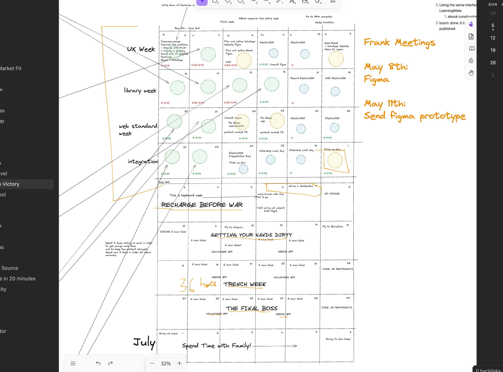

# greatness

This is the roadmap to greatness. I'll be doing all my testing here.

### Abstract
We will be implementing my Learning Processs. It is not perfect. We will be learning everything detailed below.

## Frontend
### Design Systems
#### Tech Stack
1. Determine entire design system
	1. colors, whitespace, fontSizes
	2. figure out how to do light theme from getgo
2. Component libraries
	1. Shadcn. You have to use React.
#### Project
- Redo Model Portfolio site.
	- Create [[base layout]] for both websites.
### Figma
1. Get good at Figma. Take a course.
	1. https://youtu.be/cKZEgtQUxlU?si=RZyxhYI3K609c4Qp
	2. lmao take this entire course. It is 6 hours long.
#### Project
It's ok if this is scrap. That's because it is worth just taking a course to learn it.
### Testing
#### Tech
1. Frontend testing suite
2. A/B Testing + User Analytics
	1.  [PostHog - The open source Product OS](https://posthog.com/)
	2. Deployment
		1. Netlify vs Vercel capabilities
#### Project
Model Portfolio
### Web Standards
#### Tech
1. PWA
	1. Right from getgo. No questions asked.
2. Web workers + Service workers
	1. You will need this for your high intensive frontend processing.
3. Saddlebag
	1. IndexxedDB & statefulness
		1. Implement during Excalidraw
#### Project
* Beginnings of Thrannotations feature?
* Mess around with instantiating multiple Excalidraw instances
### Integrate Excalidraw Exercise
### Tech
Excalidraw + React + vite
#### Project
* See web standards

## Backend
### AI, LOL
* We're going to need an AI model that produces POSTERS. So Figure out how to get respective model on Fly.io.
	* Integrate an already existing one. 
	* OR MAKE IT DAMNIT.
## Supabase
* Auth integrations
* Email integrations
---
That's it. Everything else has been decided
* Fly.io, check
* Golang, check

## PMF
1. We need to be researching the PMF the whole time. Because our product is reflected by the PMF.
### Industry
* What is out there
	* What features can we copy
	* What features suck ass. Just absolute ass
* What isn't out there
	* Think of ideas and why they are not there.
* The state of the industry
	* List of companies doing what
	* Make a mental map of all competition in all segments of industry
## Research
* EBook
	* Reread specification. Understand it in and out.
* Volunteer
	* Investigate how Volunteer Match is able to get 501c orgs to "Claim" their company
	* MAYBE we could integrate our features into their data. They have the data. We have the engineering.
### Make User Features Clear Af.
#### Template:
User Perspective:
User want:
Implementation: